# Модуль NRF24L01 plus

## Інтерфейси та характеристики

### Радіочастота

Модуль приймача nRF24L01 + призначений для роботи в частотному діапазоні частот [ISM (industrial, scientific and medical)](https://uk.wikipedia.org/wiki/ISM) 2,4 ГГц 
і використовує Гаусову модуляцію ([GFSK](https://web.archive.org/web/20110119025729/http://digital.sibsutis.ru/WLL/GMSK.htm)) для передачі даних. 
Швидкість передачі даних конфігурується программою мікроконтроллера, 
та може бути 250kbps, 1Mbps або 2Mbps.

### Споживання енергії

Робоча напруга модуля становить від 1,9 до 3,6 В, але гарна новина полягає в тому, 
що логічні входи мають 5-вольтову толерантність, 
тому ми можемо легко підключити його до Arduino або будь-якого логічного мікроконтролера 5В, 
не використовуючи жодного логічного перетворювача рівня.

Модуль підтримує програмовану вихідну потужність, а саме. 0 дБм, -6 дБм, -12 дБм або -18 дБм 
і споживає близько 12 мА під час передачі при 0 дБм, що навіть нижче, ніж у одного світлодіода. 
А найкраще, що він споживає 26 мкА в режимі очікування та 900 нА в режимі відключення живлення. 
Таким чином пристрої з радіоінтерфейсом nRF24L01, 
можуть працювати роками від батарейного живлення.

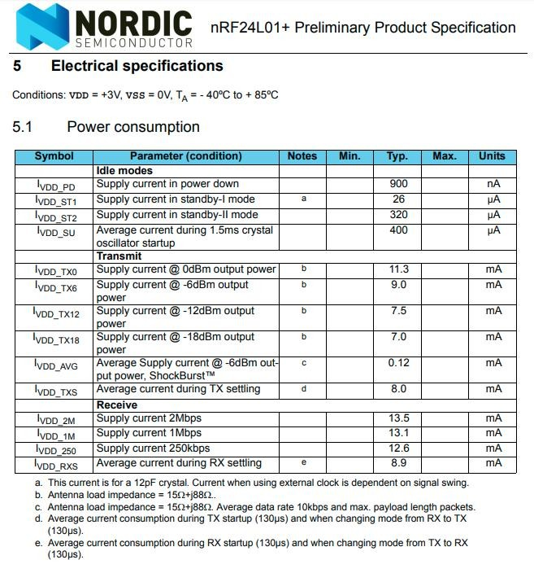

### SPI інтерфейс

Модуль приймача nRF24L01+ підключається до мікроконтроллера через 4-контактний послідовний периферійний інтерфейс (SPI) 
з максимальною швидкістю передачі даних 10Мбіт/с. 
Всі параметри, такі як:

- частотний канал (125 каналів, що вибираються);
- вихідна потужність (0 дБм, -6 дБм, -12 дБм або -18 дБм); 
- швидкість передачі даних (250 кбіт / с, 1 Мбіт / с або 2 Мбіт / с); 

можуть бути налаштовані через інтерфейс SPI.
Шина SPI використовує концепцію Master/Slave, в більшості поширених застосувань Arduino - це Master, а модуль приймача nRF24L01+ - Slave. 

Таблиця характеристик модуля:

| Характеристика | Значення |
| ----------- | ----------- |
| Діапазон частот      | 2.4 GHz, ISM діапазон       |
| Максимальна швидкість передачі даних   | 2 Mb/s        |
| Формат модуляції | Гаусова модуляція |
| Робоча напруга живлення | від 1.9 В до 3.6 В |
| Максимальний струм | 13.5mA |
| Мінімальний струм (в режимі очікування) | 26uA |
| Логічний вхід | 3-5 В |
| Дальність передачі сигналу | до 800 м прямої видимості |


### Зовнішній вигляд модуля NRF24L01+

На основі чіпа nRF24L01+ доступні різноманітні модулі. 
Нижче представлені найпопулярніші версії.

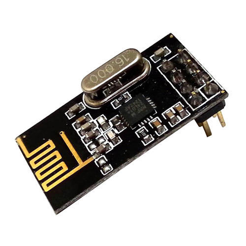
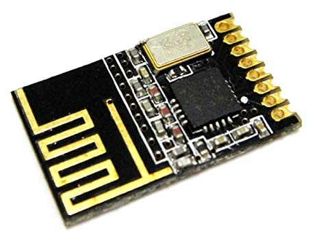

Перші два варіанти з антеною на платі. 
Таким чином плата виходить більш компактною. 
Однак менша антена також означає меншу дальність передачі. 
Ця версія модуля здатна вести передачу до 100 метрів в зоні прямої видимості. 
У приміщенні зі стінами, відстань передачі буде меншою.

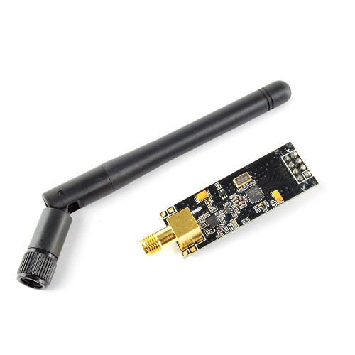

Друга версія має коаксіальний роз'єм та duck-антену, але це не єдина відмінність. 
Справжня відмінність полягає в тому, що модуль поставляється зі спеціальним 
[RFX2401C](http://ultran.ru/sites/default/files/rfx2401c_eval_board_summary_and_technical_notes_revb1.pdf) 
чіпом. 
Цей чіп разом з duck антеною допомагає модулю 
досягти значно більшого діапазону передачі, близько 1000 м.

### Що таке PA LNA

PA означає посилювач потужності (Power Amplifier).
Це збільшує потужність сигналу, що передається з чіпа nRF24L01+. 
Тоді як LNA розшифровується як підсилювач з низьким рівнем шуму (Low-Noise Amplifier). 
Функція LNA полягає в тому, 
щоб приймати надзвичайно слабкий і невизначений сигнал з антени 
(як правило, на порядок мікровольт або менше -100 дБм) 
і посилити його на більш корисний рівень (зазвичай приблизно від 0,5 до 1 В)

LNA та PA підключаються до антени через дуплекспер, 
який розділяє два сигнали і запобігає відносно потужному виходу PA 
від перевантаження чутливого входу LNA.

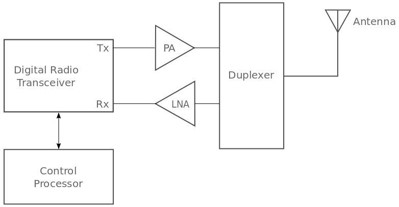

Читайте про те, що таке PA LNA на StackOverflow - 
[https://electronics.stackexchange.com/questions/237267/what-is-a-pa-lna](https://electronics.stackexchange.com/questions/237267/what-is-a-pa-lna)

## Принцип роботи nRF24L01+

### Канал передачі данних (Pipes)

Модуль приймача nRF24L01+ передає та приймає дані на певній частоті (Канал або Channel). 
Також для того, щоб два або більше модулів приймача могли спілкуватися один з одним, 
вони повинні знаходитися на одному каналі.  
Цей канал може бути будь-якої частоти в діапазоні ISM 2,4 ГГц або, 
якщо бути точнішим, він може бути від 2,400 до 2,525 ГГц (2400 до 2525 МГц).

Кожен канал займає смугу пропускання менше 1 МГц.  
Це дає нам 125 можливих каналів з інтервалом 1 МГц. 
Отже, модуль може використовувати 125 різних каналів, 
що дає можливість мати мережу з 125 незалежно 
працюючих мереж (6 Data Pipes +1 передавач) в одному місці.

### nRF24L01+ MultiCeiver (TM) Network (Data Pipes)

NRF24L01+ надає функцію під назвою Multiceiver. 
Це абревіатура для декількох передавачів одного приймача. 
У якому кожен радіочастотний канал логічно розділений на 6 паралельних каналів даних, 
що називаються Data Pipes. 
Іншими словами, канал даних - це логічний канал у фізичному радіочастотному каналі. 
Кожна передача даних має свою фізичну адресу (Data Pipe Address) і може бути налаштована. 
Це можна проілюструвати, як показано нижче.

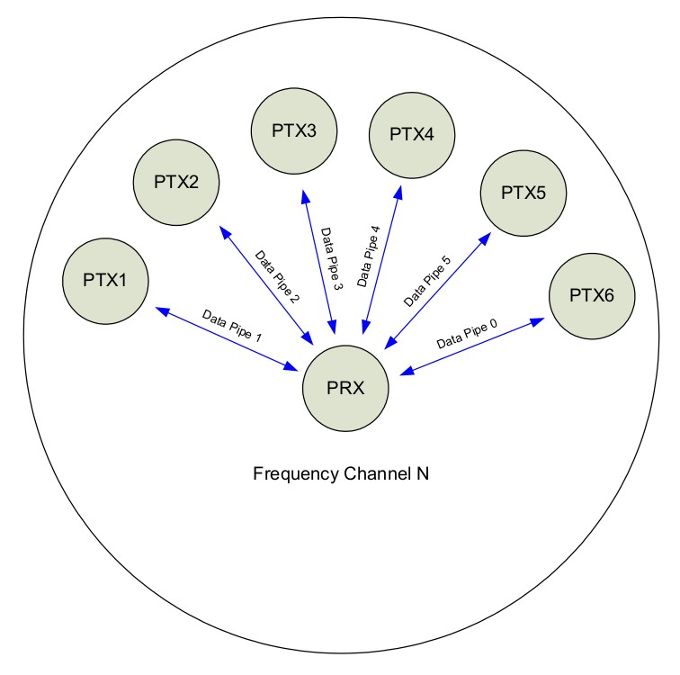

PRX нода, настроєна на пройом з 6 різних нод передавачів. 
Приймач може перестати слухати будь-який час і виконувати функцію передавача,
але в такому разі він зможе передавати лише в один data pipe одночасно.

Слід зазаначити, що канали нумеруються від 0 до 5. 
Канал з 1 по 5 використовуються тільки для зчитування данних.
Тоді як 0-й канал, буде використано як для передачі так і для прийому.  
Піля завершення передачі по 0-му каналу і початку прийому (і навпаки),
слід виставити відповідну адресу:

```c
#define DIR_FIRST_SECOND 00001
#define DIR_SECOND_FIRST 00101

RF24 radio(9, 10); // CE, CSN
radio.openReadingPipe(0, DIR_SECOND_FIRST);
radio.startListening();

if (radio.available()) {
    char message[8];
    // зчитуємо 8 байт повідомлення у змінну message
    radio.read(message, sizeof(message));
}

radio.stopListening();
radio.openWritingPipe(DIR_FIRST_SECOND);
// тепер нульовий канал -  DIR_FIRST_SECOND а не DIR_SECOND_FIRST
// тому потрібно заново правильний відкрити канал для чинання
radio.write("Hello AKIT", 10);
// Потрібо наново відкрити нульовий карал для читання після write
radio.openReadingPipe(0, DIR_SECOND_FIRST);
radio.startListening();
```

Якщо немає необхідності читати данні з 6 каналів одночасно,
рекомендуємо відкривати канали для зчитування данних починаючи з 1,
а нульовий канал лише для передачі.

Щоб вести передачу по декількох каналах одночасно,
слід відкрити відповідний канал перед передачою:

```c
#define DIR_FIRST_SECOND 00001
#define DIR_FIRST_THIRD 00002
#define DIR_SECOND_FIRST 00101
#define DIR_THIRD_FIRST 00102
#define READ_FIRST_PIPE 1
#define READ_SECOND_PIPE 2
uint8_t READ_CURRENT_PIPE;

RF24 radio(9, 10); // CE, CSN
radio.openReadingPipe(READ_FIRST_PIPE, DIR_SECOND_FIRST);
radio.openReadingPipe(READ_SECOND_PIPE, DIR_THIRD_FIRST);
radio.startListening();

// При прослуховуванні декількох каналів, має значення номер каналу
// за яким доступні данні 
if (radio.available(&READ_CURRENT_PIPE)) {
    if (READ_CURRENT_PIPE == READ_FIRST_PIPE) handleFirsPipe();
    if (READ_CURRENT_PIPE == READ_SECOND_PIPE) handleSecondPipe();
}

radio.stopListening();
radio.openWritingPipe(DIR_FIRST_SECOND);
radio.write("Hello AKIT", 10);
radio.openWritingPipe(DIR_FIRST_THIRD);
radio.write("AKIT is the best", 16);
```

### Enhanced ShockBurst протокол [link](https://devzone.nordicsemi.com/nordic/nordic-blog/b/blog/posts/intro-to-shockburstenhanced-shockburst)

Модуль приймача nRF24L01+ використовує структуру пакетів, 
відому як Enhanced ShockBurst. 
Ця проста структура пакетів розбита на 5 різних полів, що проілюстровано нижче.

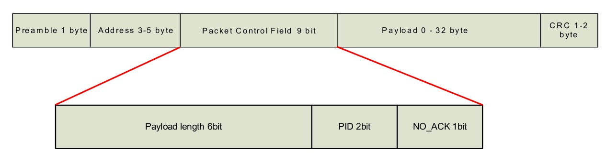

Початкова структура ShockBurst складалася лише з полів преамбули, 
адреси, корисного навантаження та 
[контрольної суми CRC](https://uk.wikipedia.org/wiki/%D0%A6%D0%B8%D0%BA%D0%BB%D1%96%D1%87%D0%BD%D0%B8%D0%B9_%D0%BD%D0%B0%D0%B4%D0%BB%D0%B8%D1%88%D0%BA%D0%BE%D0%B2%D0%B8%D0%B9_%D0%BA%D0%BE%D0%B4). 
Enhanced ShockBurst забезпечив більшу функціональність для покращеної комунікації 
за допомогою нещодавно введеного Packet Control Field (PCF).

Ця нова структура покращила якість передачі одразу по кількох пунктах. 
По-перше, вона дозволяє змінювати довжину корисних навантажень 
Playload length, 
тобто в Playload можна записати від 1 до 32 байт.

По-друге, вона надає кожному відправленому пакету ідентифікатор пакета, 
що дозволяє пристрою, що приймає, визначати, чи є повідомлення новим, 
чи воно було повторно передано (і, таким чином, його можна ігнорувати).

Нарешті, і найголовніше, кожне повідомлення може вимагати надсилання підтвердження, 
коли воно отримане іншим пристроєм.

### Транзакції (Automatic Packet Handling)


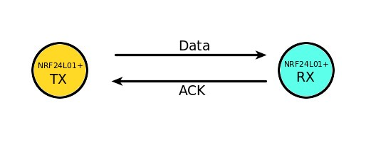

#### Успішна транзакція
Першим є приклад позитивного сценарію.  
Тут передавач починає зв'язок, надсилаючи пакет даних до приймача. 
Після передачі всього пакету він чекає (приблизно 130 мкс) 
для отримання пакета підтвердження (пакета ACK). 
Коли приймач отримує пакет, він надсилає ACK пакет передавачу. 
При отриманні пакету ACK передавач подає сигнал переривання (IRQ), 
щоб вказати, що дані успішно передані.

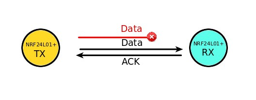

#### Трансакція з втраченим пакетом даних.  
Це негативний сценарій, коли необхідна повторна передача 
через втрату переданого пакету. 
Після передачі пакета передавач чекає отримання пакета ACK. 
Якщо передавач не отримує його протягом автоматичного затримки-затримки (ARD), 
пакет передається повторно. 
Коли повторно переданий пакет приймає приймач, 
передається пакет ACK, який, в свою чергу, генерує переривання у передавача.

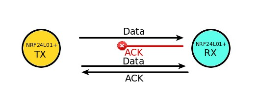

#### Трансакція з втраченим підтвердженням. 
Це знову негативний сценарій, коли необхідна повторна передача через втрату пакета ACK. 
Тут навіть якщо приймач отримує пакет з першої спроби, 
через втрату пакета ACK, передавач вважає, що одержувач взагалі не отримав пакет. 
Отже, після закінчення часу автоматичного повернення-затримки 
він повторно передає пакет. 
Тепер, коли одержувач отримує пакет, що містить той самий ідентифікатор,
що і попередній, він відкидає його і знову надсилає пакет ACK.

Вся ця обробка здійснюється автоматично чіпом nRF24L01+ 
без участі мікроконтролера.

## Arduino і nRF24L01+

### nRF24L01+ Pinout

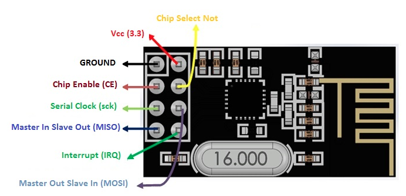

Окрім пінів живлення та стандартних пінів SPI інтерфейсу, 
наступні піни мають наступне призначення:

- Chip Enable (CE) - логічна одиниця на цей вхід зробить модуль активним.
Використовується для контролю standby mode

- CSN (Chip Select Not) - LOW активний. 
Коли цей пін LOW, nRF24L01 починає прослуховувати дані 
на своєму SPI-порту для обробки даних.

### Підключення NRF24L01 до Arduino Nano

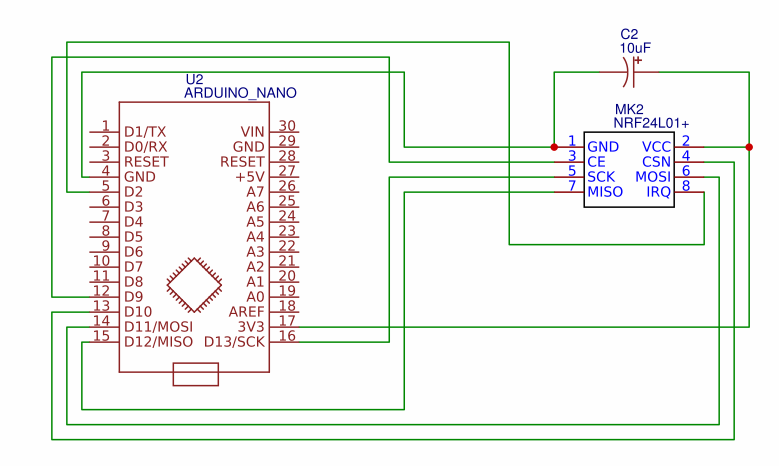

Піни SPI, а саме MOSI, MISO, SCK підкючаються до відповідних
пінів мікроконтроллера.  
Піни CE та CSN підключені до D9 і D10 відповідно  
10 мкФ-конденсатор з'єднаний з VCC та GND має бути розміщений (фізично) 
якомога ближче до модуля. 
Конденсатор стабілізує живлення модуля.  
Пін IRQ модуля підєднаний до D2, адже саме цей вхід [може бути
задіяний для преривань в Arduino Nano](https://www.arduino.cc/reference/en/language/functions/external-interrupts/attachinterrupt/)

### Бібліотеки для роботи з nRF24L01+ Module

Взаємодія з модулем приймача nRF24L01+ напряму через SPI - непроста задача, 
але, на щастя, є ряд бібліотек які вже реалізували всю рутинну роботу.

https://github.com/nRF24/RF24 - реалізує базовий функціонал. Містить інтерфейси для 
роботи з Arduino, Raspberry Pi, ATtiny. Проста у використанні для новачків, 
але все ж пропонує багато для досвідчених користувачів.

https://github.com/nRF24/RF24Network - альтернатива ZigBee

https://github.com/nRF24/RF24Mesh - ця бібліотека має намір реалізувати 
[mesh](https://uk.wikipedia.org/wiki/Mesh-%D0%BC%D0%B5%D1%80%D0%B5%D0%B6%D1%96) 
мережу для сенсорів, 
що дозволяє автоматичну та динамічну конфігурацію, 
яка може бути налаштована відповідно до багатьох сценаріїв.

### Програмний код для роботи з nRF24L01+

На початку программи необхідно підключити бібліотеки для роботи
з модулем nRF24L01+:

```c
#include <nRF24L01.h>
#include <RF24.h>
```

Після чого стане доступний класс `RF24`
Створення об'єкту, вимагає вказання `Chip Enable (CE)` та `Chip Select (CS)` 
пінів у якості аргументів. У всіх модулів це 9 та 10 цифровий пін:

```c
RF24 radio(9, 10); // CE, CSN
```

Після стврорення об'єкту, необхідно встановити налаштування модуля:

```c
// Включаємо модуль
radio.begin(); 
// Підсилення сигналу, може приймати 4 стани 
// RF24_PA_MIN, RF24_PA_LOW, RF24_PA_HIGH and RF24_PA_MAX
radio.setPALevel(RF24_PA_MIN);
// Швидкість передачі данних, може бути: 
// RF24_250KBPS for 250kbs, RF24_1MBPS for 1Mbps, 
// RF24_2MBPS for 2Mbps
radio.setDataRate(RF24_250KBPS);
// Відкриваємо Pipe для передачі данних
radio.openWritingPipe(addresses[1]); // 00001
// Відкриваємо 1 Pipe для отримання данних
// Можна одночасно відкрити до 6 таких Pipes 
radio.openReadingPipe(1, addresses[0]); // 00002
// Початок прийому данних з інших модулів
// Модуль може працювати лише в режимі прийому або передачі
radio.startListening();
// Встановлено максимальну к-сть спроб з максимайльним інтервалом
radio.setRetries(15, 15);
// Вибираємо канал передачі данних
radio.setChannel(120);
```

Таким чином модуль готовий для роботи.
Для того щоб перевірити чи доступні данні для читання з модуля
користуємось функцією `available`:
```c
uint8_t dataPipe;
if (radio.available(&dataPipe)) {
radio.read(data, sizeof(data));
}
```

Функція приймає номер data pipe для читання, якщо в программі
використовується лише один data Pipe, аргумент може бути опущений.

Щоб передати данні, спочатку переключаємось в режим передачі,
і не забуваємо після `write` повернути режим читання:

```c
radio.stopListening();
radio.write("Hello AKIT", 10);
radio.startListening();
```

Т.я. писати модуль може тільки в один Pipe, 
то данні будуть передані по раніше вибраній 
функцією `openWritingPipe` адресі.
