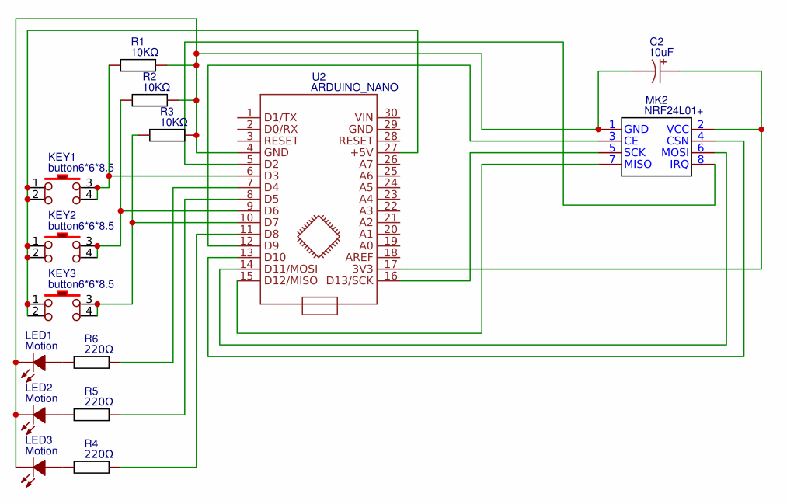

# RadioButton

### Мета роботи 
Ознайомитись з принципами бездротового зв'язку 
за допомогою модулів nRF24L01+.
Набути навиків створення та компіляції власної програми для мікроконтролера.

### Схема підключення

Схема та PCB плата https://easyeda.com/spolischook/nrf24l01-buttons

### Програма

[Программа для перевірки модуля](src/main.cpp).
При натисканні кнопок загораються відповідні світлодіоди.
