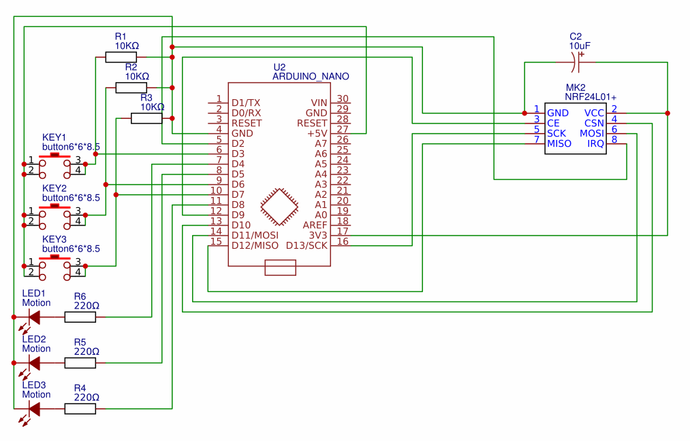

# RadioButton

### Мета роботи 
Ознайомитись з принципами бездротового зв'язку 
за допомогою модулів nRF24L01+.
Набути навиків створення та компіляції власної програми для мікроконтролера.

### Схема підключення

### Програма

