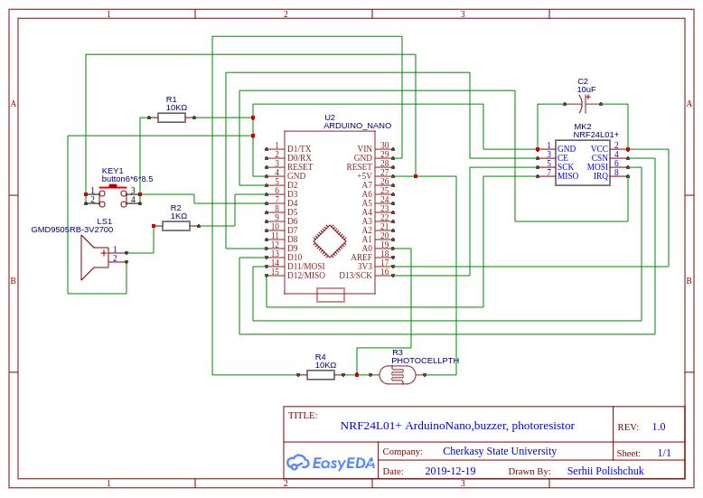
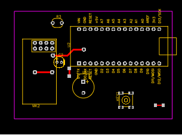
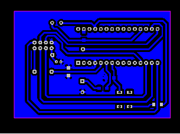

## Фоторезистивний модуль + сирена

EasyEDA project - 
https://easyeda.com/spolischook/nrf24l01-arduino-nano-zoom-photoresistor

### Схема

### BOM

|ID |Name         |Designator         |Quantity|
|---|-------------|-------------------|--------|
|1  |GMD9505RB-3V2700|LS1                |1       |
|2  |ARDUINO_NANO |U2                 |1       |
|3  |PHOTOCELLPTH |R3                 |1       |
|4  |NRF24L01+    |MK2                |1       |
|5  |10uF         |C2                 |1       |
|6  |button6\*6\*8.5|KEY1               |1       |
|7  |10KΩ         |R1,R4              |2       |
|8  |1KΩ          |R2                 |1       |

### PCB

