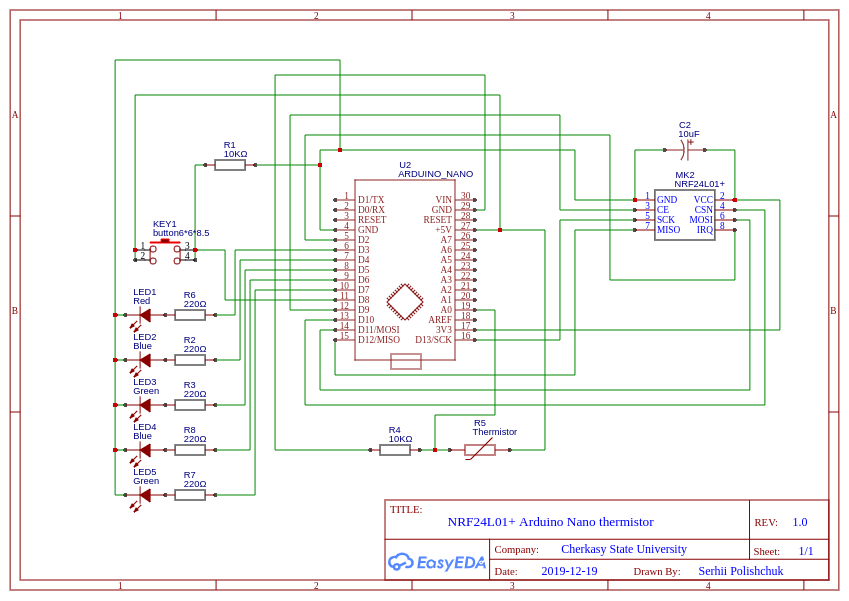
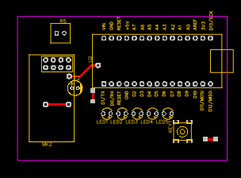
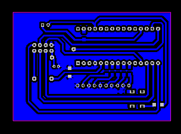

## Модуль контролю освітлення

EasyEDA project - 
https://easyeda.com/spolischook/nrf24l01-arduinonano_termistor

### Схема електрична принципова

### BOM

|ID |Name         |Designator         |Quantity|
|---|-------------|-------------------|--------|
|1  |Thermistor   |R5                 |1       |
|2  |ARDUINO_NANO |U2                 |1       |
|3  |NRF24L01+    |MK2                |1       |
|4  |Green        |LED3,LED5          |2       |
|5  |Blue         |LED2,LED4          |2       |
|6  |Red          |LED1               |1       |
|7  |10uF         |C2                 |1       |
|8  |button6*6*8.5|KEY1               |1       |
|9  |10KΩ         |R4,R1              |2       |
|10 |220Ω         |R6,R2,R3,R7,R8     |5       |

### Друкована плата (PCB)

### Програмне забезпечення

[Программа для перевірки модуля](src/main.cpp).

