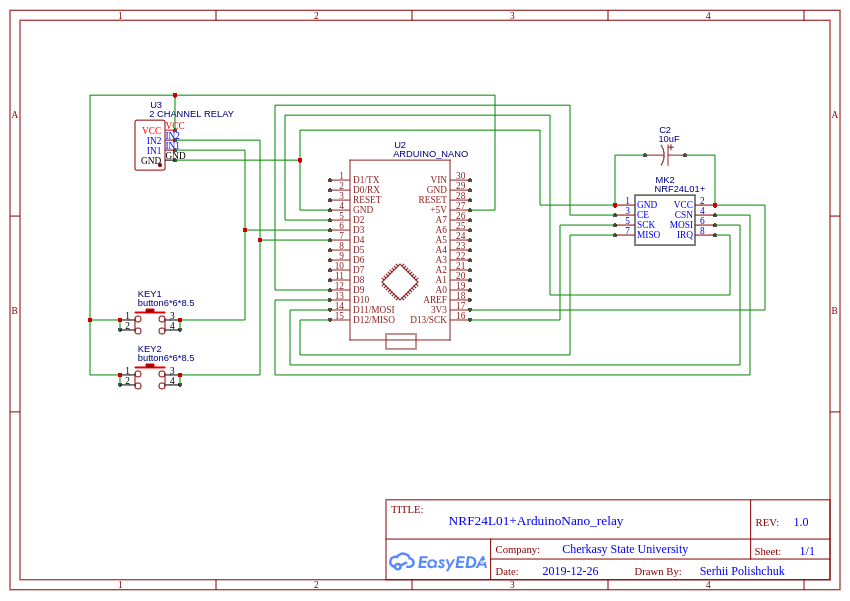
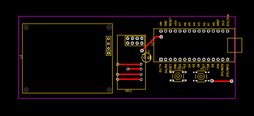
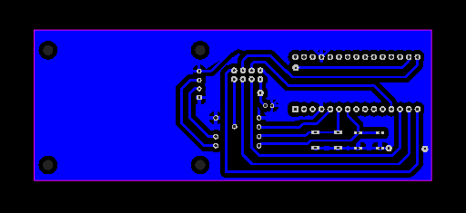

## Модуль з 2 релле

EasyEDA project - 
https://easyeda.com/spolischook/nrf24l01-arduinonano_termistor

### Схема

### BOM

|ID |Name         |Designator         |Quantity|
|---|-------------|-------------------|--------|
|1  |2 CHANNEL RELAY|U3                 |1       |
|2  |ARDUINO_NANO |U2                 |1       |
|3  |NRF24L01+    |MK2                |1       |
|4  |10uF         |C2                 |1       |
|5  |button6\*6\*8.5|KEY1,KEY2          |2       |

### PCB

### Програма

[Программа для перевірки модуля](src/main.cpp).

