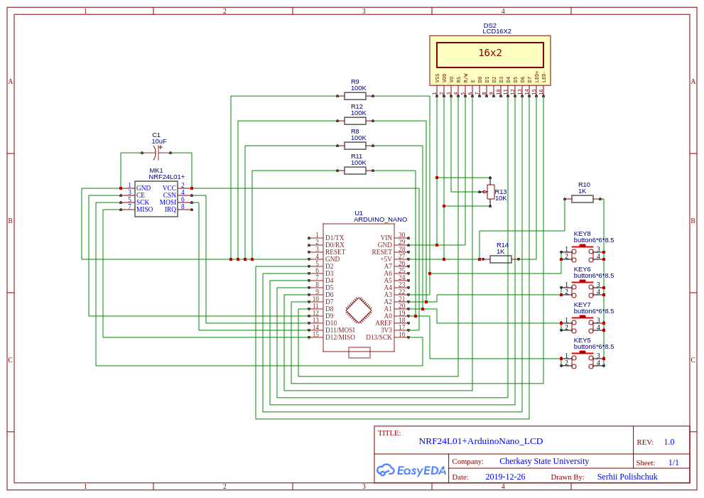
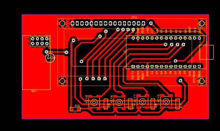
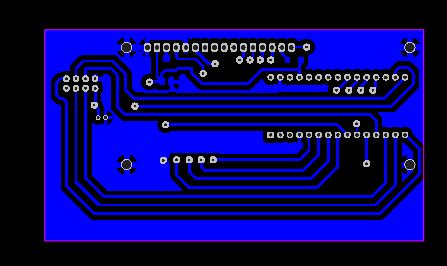

## ArduinoNano NRF24L01+ LCD

EasyEDA project - 
https://easyeda.com/spolischook/nrf24l01-arduinonano-lcd

### Схема

### BOM

|ID |Name         |Designator         |Quantity|
|---|-------------|-------------------|--------|
|1  |ARDUINO_NANO |U1                 |1       |
|2  |NRF24L01+    |MK1                |1       |
|3  |10K          |R13                |1       |
|4  |10uF         |C1                 |1       |
|5  |LCD16X2      |DS2                |1       |
|6  |button6\*6\*8.5|KEY5,KEY6,KEY7,KEY8|4       |
|7  |100K         |R8,R9,R11,R12      |4       |
|8  |1K           |R10,R14            |2       |

### PCB

### Дефекти

В схемі, а точніше в її фізичній реалізації, є один суттєвий недолік.
Функція `radio.write()` повертає 0, незалежно від фактичної доставки
повідомлення до приймача. Таким чином пакет `Ack` ігнорується.  
Дефект зберігається при зміні модуля `NRF24L01+`
